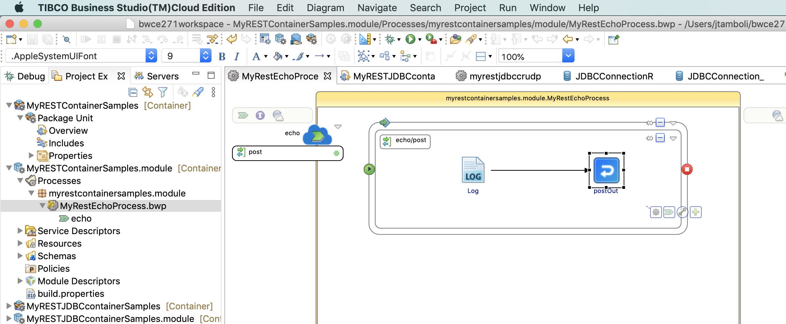
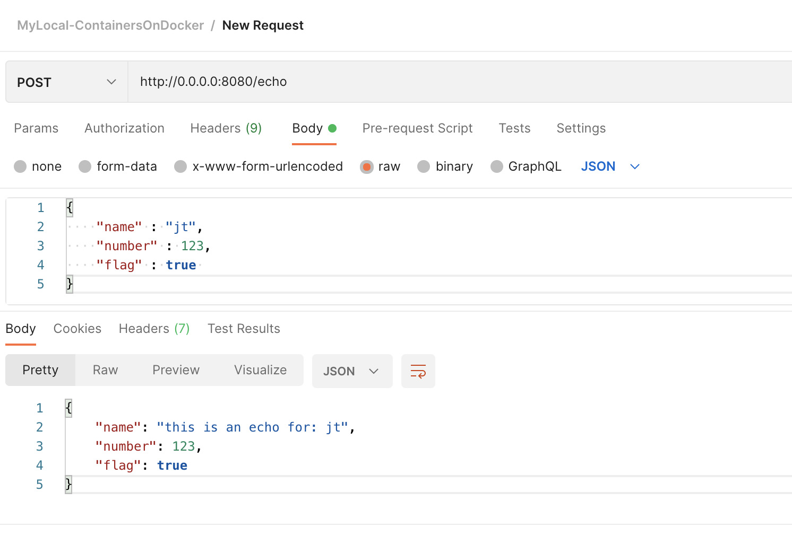
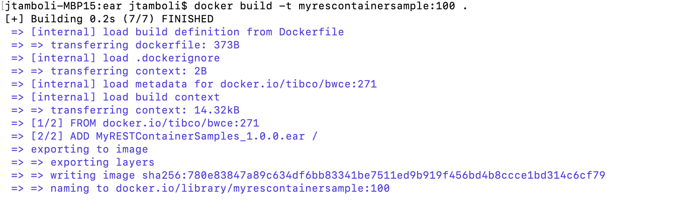
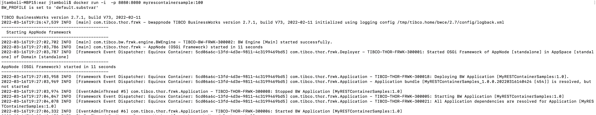

## Import restechoprocess.zip
You can choose to import Samples/restechoprocess.zip. This project contains a post method that echos back the request being sent to post api.

After Importing the project find and open MyRestEchoProcess.bwp.  

You can debug/run the project locally in designer and test it out using a postman . The request and response looks like following :

### Generating an Application Archive File
Follow these steps to generate the .EAR file:

Procedure
Expand the Package Unit and select Overview.
In the Overview window select Export Application for Deployment.
Enter the location of your EAR file.
[The ear is also available under /Samples/restecho/restechoear/MyRESTContainerSamples_1.0.0.ear]

### Building the Application Image
Procedure
Copy the Dockerfile from the samples directory [/Samples/restecho/restechoear/Dockerfile] to the location where you placed the EAR file.

From the docker terminal, navigate to the folder where the EAR and Dockerfile are stored.
In the Dockerfile, make sure the base image points to the TIBCO BusinessWorks Container Edition runtime base image.
Also make sure the ear file path and name is correct.

FROM tibco/bwce:271
MAINTAINER Tibco
ADD MyRESTContainerSamples_1.0.0.ear /EXPOSE 8080

Type in below command on the docker terminal to generate the application image.
docker build -t myrescontainersample:100 .

You will see following message in your docker terminal

### Execute the following command on a docker terminal to run the application image:
docker run -i  -p 8080:8080 myrescontainersample:100

You will see following logs in your docker terminal

Also Test it out using a post man , once successful you will observe following logs in your terminal in addition to testing successful response on postman request.
2022-03-16T19:33:49,179 INFO  [bwEngThread:In-Memory Process Worker-1] c.t.b.p.g.L.M.module.Log - hello
