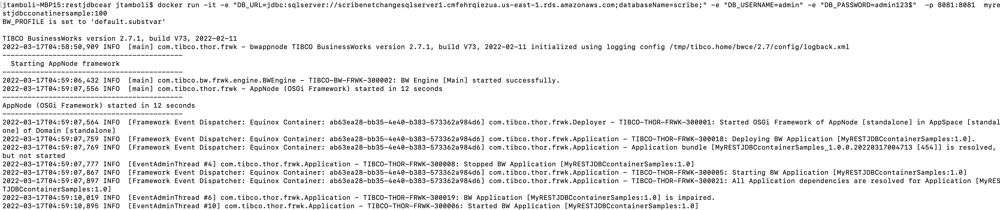

## Import restkafkaproject.zip
You can also choose to import /Samples/restjdbc/restkafkaprocess.zip. This project contains a post/get/delete method(s) that perform crud on a database and sends reponse back to those requests.

After Importing the project find and open MyRestEchoProcess.bwp.  

Once imported you would need to point to an existing sql server instance. I have used a sql server in AWS / You can use it locally too.
You can debug/run the project locally in designer and test it out using a postman . The request and response looks like following :

### Generating an Application Archive File
Follow these steps to generate the .EAR file:

Procedure
Expand the Package Unit and select Overview.
In the Overview window select Export Application for Deployment.
Enter the location of your EAR file.
[The ear is also available under /Samples/restjdbc/restjdbcear/MyRESTJDBCcontainerSamples_1.0.0.ear]

### Building the Application Image
Procedure
Copy the Dockerfile from the samples directory [//Samples/restjdbc/restjdbcear/Dockerfile] to the location where you placed the EAR file.

From the docker terminal, navigate to the folder where the EAR and Dockerfile are stored.
In the Dockerfile, make sure the base image points to the TIBCO BusinessWorks Container Edition runtime base image.
Also make sure the ear file path and name is correct. e.g below

FROM tibco/bwce:271
MAINTAINER Tibco
ADD MyRESTJDBCcontainerSamples_1.0.0.ear / 

Type in below command on the docker terminal to generate the application image.
ddocker build -t myrestjdbcconatinersample:100 .

You will see following message in your docker terminal

### Execute the following command on a docker terminal to run the application image:
restjdbcear jtamboli$ docker run -it -e "DB_URL=jdbc:sqlserver://scribenetchangesqlserver1.cmfehrqiezua.us-east-1.rds.amazonaws.com;databaseName=scribe;" -e "DB_USERNAME=admin" -e "DB_PASSWORD=admin123$"  -p 8081:8081  myrestjdbcconatinersample:100

You will see following logs in your docker terminal

Also Test it out using a postman or any other api tool , once successful you will observe following logs in your terminal in addition to testing successful response on postman request.

2022-03-17T05:00:17,487 INFO  [bwEngThread:In-Memory Process Worker-1] c.t.b.p.g.L.M.module.Log_jdbc_insert - insert-customer-flow
2022-03-17T05:01:00,059 INFO  [bwEngThread:In-Memory Process Worker-2] c.t.b.p.g.L.M.module.Log-jdbc-query - inside-query-flow for customerid:28a7a394-6c02-419e-b6be-cdfdb2fb4dce
2022-03-17T05:01:09,955 INFO  [bwEngThread:In-Memory Process Worker-5] c.t.b.p.g.L.M.module.Log-jdbc-delete - inside-delete-flow
